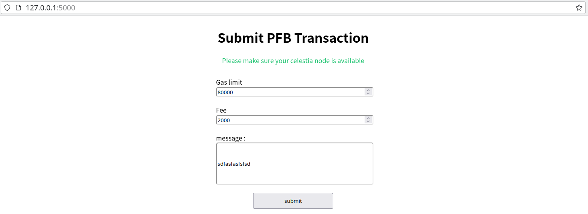
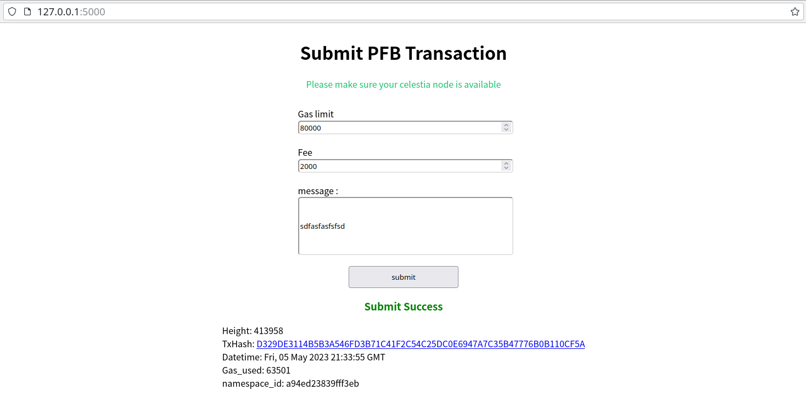

# submit_celestia_PFB

UI for submit celestia pfb.

at first, make sure to run a [celestia light node](https://docs.celestia.org/nodes/light-node/) with port 26659.

How to run? 
1) Install the required dependencies: 

    pip install Flask==2.2.3

    pip install requests==2.28.2

2) Run script: `python main.py`
3) Go to http://127.0.0.1:5000 and submit pfb transaction